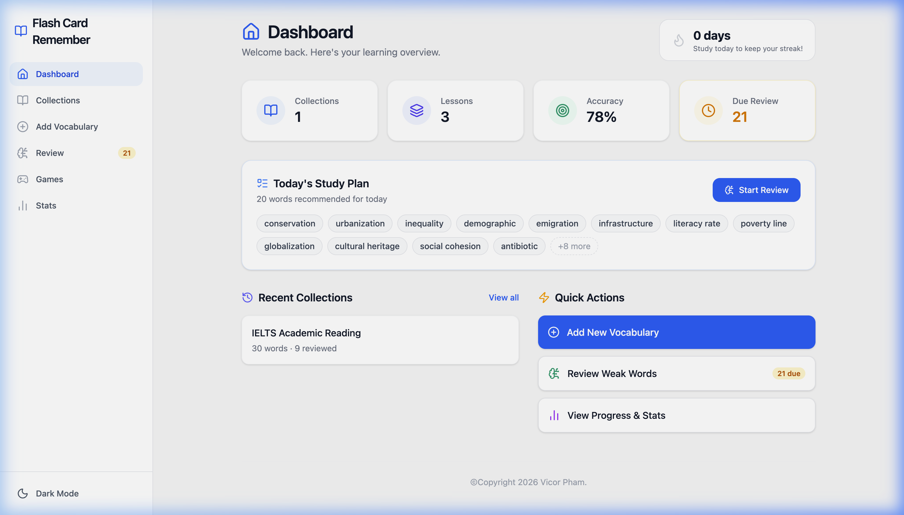
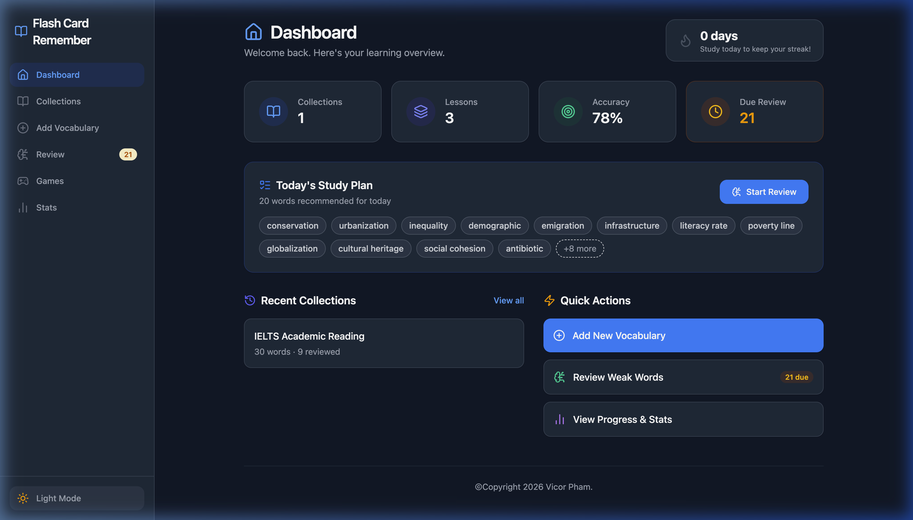
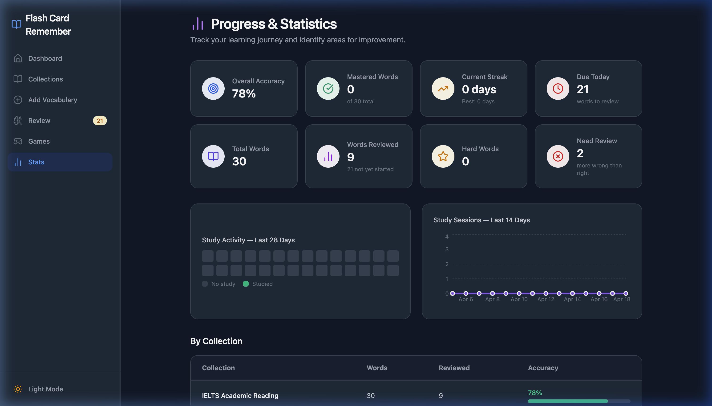
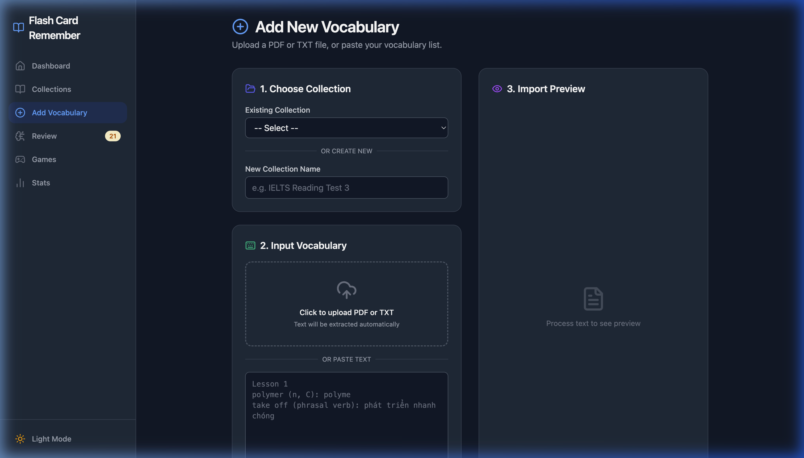
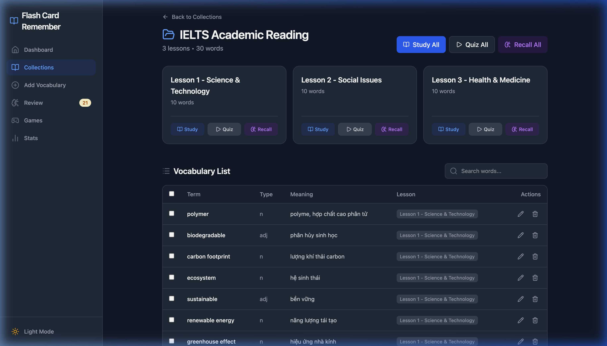
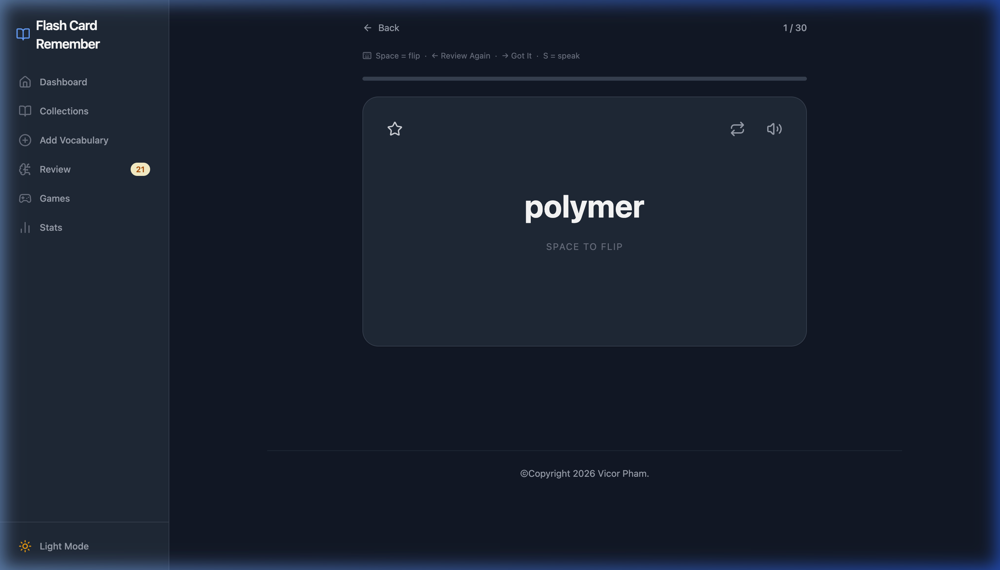
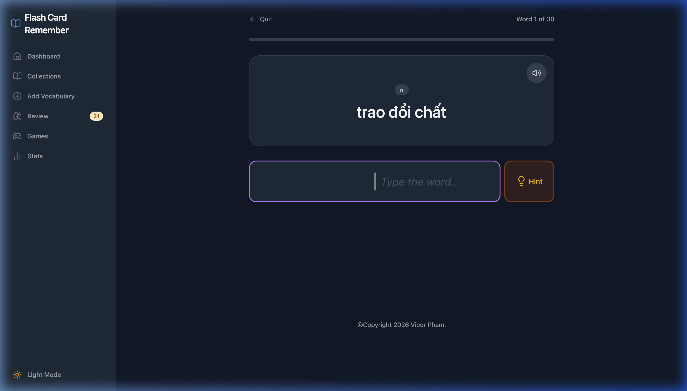
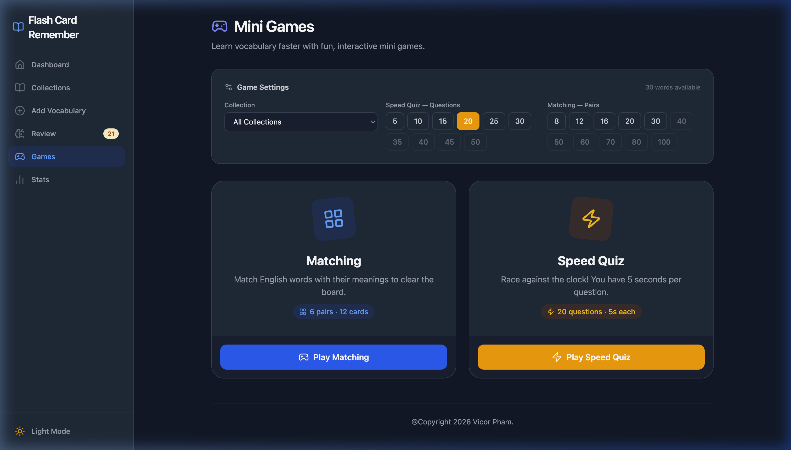
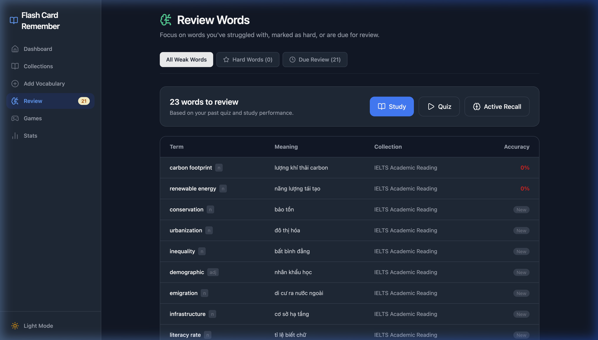
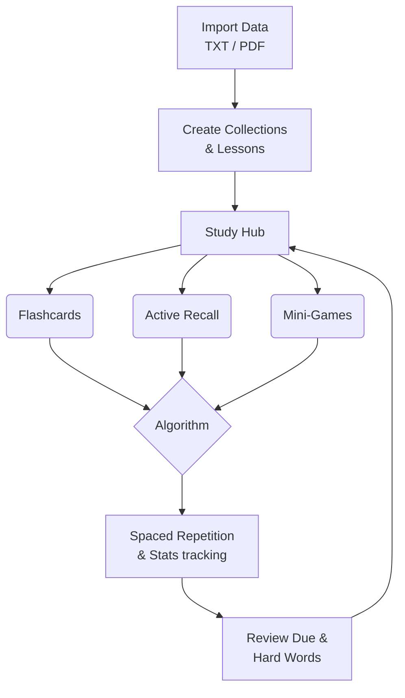

<div align="center">
  
  
  
  
  
</div>

<h1 align="center">Flash-Cards-Remember</h1>

<div align="center">
  <strong>An elegant, powerful, and intelligent Flashcard ecosystem.</strong><br>
  <em>Developed by <b>Victor Pham</b></em>
</div>

<br />

<div align="center">
  
  <details>
    <summary>🌙 <b>View Dark Mode</b></summary>
    <br/>
    
  </details>
</div>

<br />

## 🌟 Overview

**Flash-Cards-Remember** is a modern, feature-rich web application built to supercharge your learning journey. Leveraging the power of Active Recall, gamification, and document parsing, it transforms how you memorize and study information. 

Designed with a beautiful, responsive UI, it provides everything you need to build, study, and master your vocabulary collections entirely offline in your browser.

---

## ✨ Features Showcase

### 📊 Smart Dashboard & Analytics
Track your learning progress, mastery levels, and study streaks over time. View your learning heatmaps and see exactly where you need improvement.

<div align="center">
  
</div>

### 📄 Intelligent Document Import
Seamlessly import your learning materials. Paste formatted text, or use AI (Gemini) to automatically extract vocabulary directly from PDF files.

<div align="center">
  
</div>

### 🃏 Organized Collections
Manage multiple lessons within a single collection. Fully searchable and easy to bulk-edit.

<div align="center">
  
</div>

### 🤔 Interactive Study Mode
Study standard flashcards with Text-to-Speech (TTS) capabilities. Hit the spacebar to flip, and rate the difficulty using built-in Spaced Repetition Logic.

<div align="center">
  
</div>

### ✍️ Active Recall Training
Force your brain to retrieve answers via typing mode. Gives you real-time colored character feedback.

<div align="center">
  
</div>

### 🎮 Gamified Learning
Bored of standard study? Engage with fun mini-games like the interactive *Matching Game* and the fast-paced *Speed Quiz*.

<div align="center">
  
</div>

### 🧠 Focused Review Hub
Automatically filters out the noise. Focus only on words marked as "Hard", or words that are due for review based on the Spaced Repetition algorithm.

<div align="center">
  
</div>

---

## 🛠️ Tech Stack

| Category | Technology |
|---|---|
| **Frontend Framework** | React 19 + TypeScript |
| **Build Tool** | Vite |
| **Styling** | Tailwind CSS + Framer Motion (Fluid Animations) |
| **State Management** | Zustand (Persistent Local Storage) |
| **Routing** | React Router v7 |
| **Icons & UI** | Lucide React, Canvas Confetti |

---

## 🚀 Getting Started

Follow these steps to set up the project locally on your machine.

### Prerequisites

Make sure you have Node.js installed. We recommend using **Node 18+**. (Using `bun` is highly recommended for speed).

### Installation

1. **Clone the repository**:
   ```bash
   git clone git@github.com-personal:ducthinh17/Flash-Cards-Remember.git
   cd Flash-Cards-Remember
   ```

2. **Install dependencies**:
   ```bash
   npm install
   # Or using bun: bun install
   ```

3. **Set up Environment Variables**:
   Create a `.env.local` file at the root of the project to enable the AI PDF Parser. Add your Gemini API Key:
   ```bash
   GEMINI_API_KEY=your_gemini_api_key_here
   ```

4. **Run the Development Server**:
   ```bash
   npm run dev
   # Or using bun: bun run dev
   ```

5. **Open your browser** and visit `http://localhost:3000` to see the application in action.

---

## 🎓 How It Works (Learning Flow)



---

## 📝 License

This project is licensed under the **MIT License**. See the [LICENSE](LICENSE) file for details.

---

<div align="center">
  Made with ❤️ by <b>Victor Pham</b>
</div>
